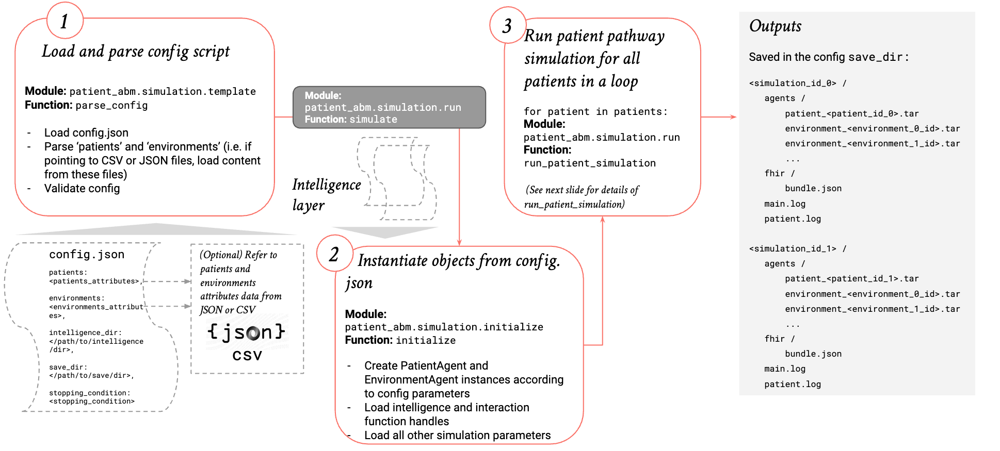

> | "Developing an agent-based simulation for generating synthetic patient pathways and scenario modelling for healthcare specific implementations."   

<figcaption>Figure 1: Overview of the Synpath data model</figcaption>

A data model (“Patient Agent”) was developed for fake patients to be defined in the simulation.  The patient is then assigned a health record (conditions, medications,  ..) with optional additional attributes. 

Interacting this data model over time with an environment layer (representation of the physical and abstract health system components that the patient can interact with (e.g., GP practice, multidisciplinary team meeting)) creates a patient record with appointment times, updates to health status, and changes in medications prescribed.  

## Results 

Foundations were built for the data model and environment.  

During the development it became clear that a key nature to be included for healthcare agent simulations in the NHS is the distinction between active and passive agents in regards to the choice of the next environment interaction point.   The spatial location of services was less important than in a typical agent-based simulation as the timescales made these considerations redundant.   

Efficient object communication and concurrency were also highlighted needing significant further development. 

| Output | Link | 
| ---- | ---- |
| Open Source Code & Documentation | [Github](https://github.com/nhsx/SynPath) |
| Case Study | Awaiting Sign-Off |
| Technical report | [Here](https://github.com/nhsx/SynPath/blob/master/reports/REDACTED_C245%20ABM%20Patient%20Pathways_Final%20Report_V3_28042021.cleaned.pdf) |